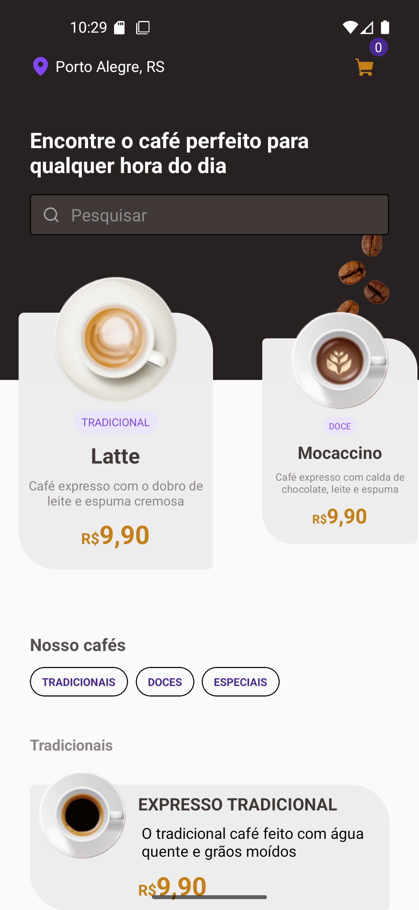
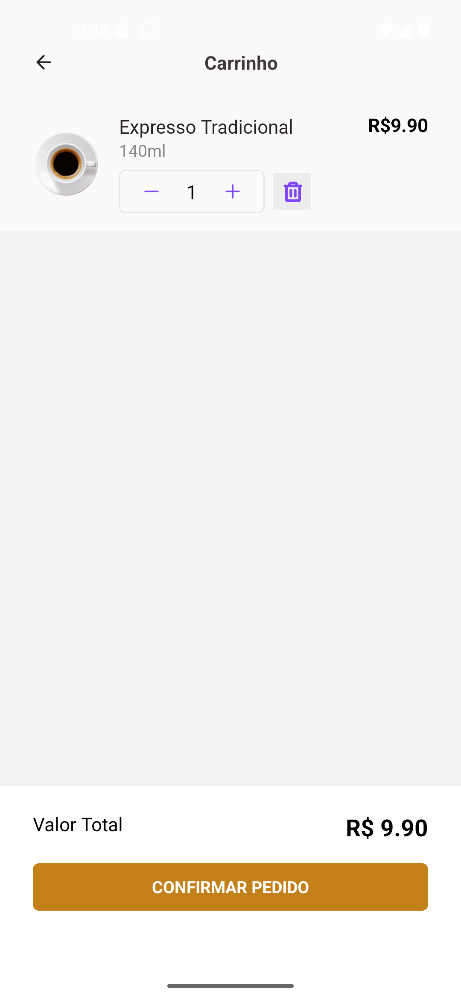
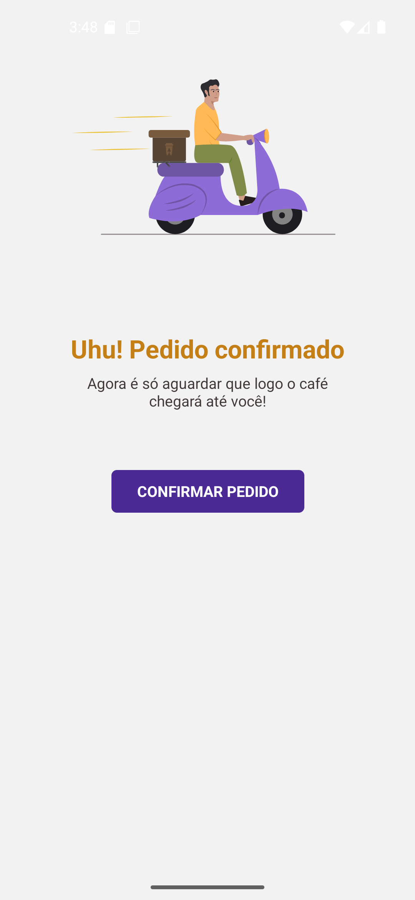

# ☕ Coffee Delivery App (UI Only)

A mobile UI-only application for a coffee shop delivery experience built with **React Native** and **Expo**.  
This project focuses on **interface design, animations, and navigation**, without any backend or real ordering system.

The goal of this app is to simulate a modern coffee delivery interface, exploring smooth animations, styled components, and mobile-first UX patterns.

## ⚠️ Attention

This project was developed using **Brazilian Portuguese (pt-BR)** in screen texts.  
Labels, and UI texts may be written in Portuguese.

---

## ✨ Features

- UI-only coffee delivery experience
- Home screen with featured coffees
- Product details screen
- Animated components and transitions
- Custom buttons, inputs, and toasts
- Fully styled with utility-first CSS

---

## 🛠️ Main Technologies

### ⚛️ Core

- **React Native** – Mobile app framework
- **Expo** – Tooling, build system, and native APIs

### 🧭 Navigation

- **Expo Router** – File-based routing system
- **React Navigation** – Native navigation primitives

### 🎨 Styling & UI

- **NativeWind + TailwindCSS** – Utility-first styling
- **Gluestack UI** – Ready-to-use UI components (buttons, inputs, overlays, toasts, icons)
- **Expo Vector Icons** – Icon pack integration

### 🎬 Animations & Graphics

- **React Native Reanimated** – High-performance animations
- **@legendapp/motion** – Declarative animations
- **React Native Skia** – Advanced 2D graphics and effects
- **React Native Gesture Handler** – Touch and gesture interactions
- **React Native SVG** – SVG rendering

### 📱 System & UX

- **Safe Area Context** – Screen safe area handling
- **React Native Screens** – Native screen optimizations
- **Expo Splash Screen** – Custom splash screen
- **Expo Font** – Custom font loading
- **Toastify React Native** – Toast notifications

---

## 📦 Installation

Clone the repository and install dependencies:

```bash
git clone https://github.com/ViniciusMassari/coffeeshop.git
cd coffeeshop
npm install
```

```bash
npx expo start
```

---

# Screenshots

<p align="center"> 
  
  
  
</p>
